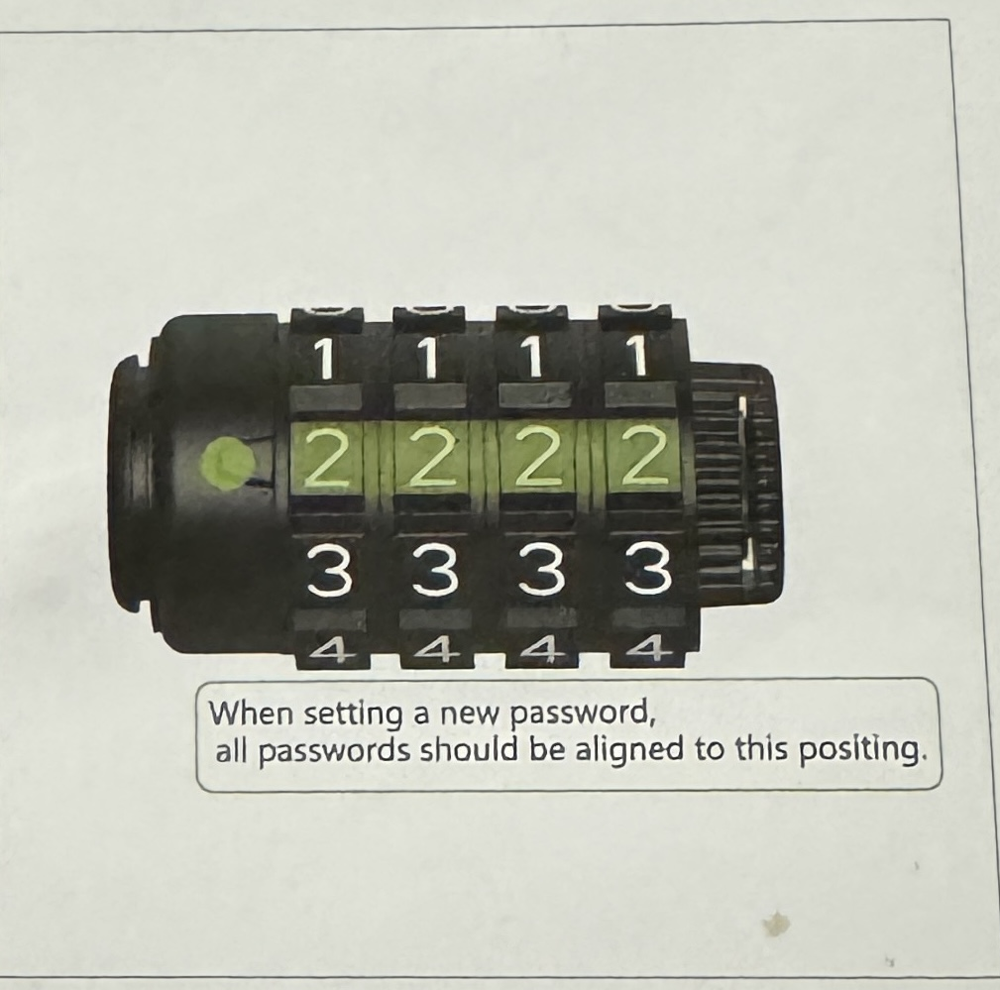

# How To Set Up and Use Scooter Lock

Scooter locks are very convenient when in a college atmosphere, as they provide you with security of your scooter. 

## Equipment  

- Scooter lock

- Scooter

  ## Steps

1. Unpackage

 - carefully take the scooter lock out of the package.

2. Open lock

 - open lock with default combination "0000".

   > 

   
3. Begin to reset password
   
 - Rotate the built in rotary knob forward 90 degrees according to the indicated direction.

   > 
   
4. Set new combination
   
 - Make sure each key is aligned with the markings.

   > 

5. Confirm the combination

 - Rotate the knob backward 90 degrees to the default position

  > 

6. Mess up combination

- Randomly sort your numbers so that no one knows your password

7. Fasten and hook lock to scooter

> 

8. Release lock from scooter

- Push button on scooter to release the lock

  > 

   
